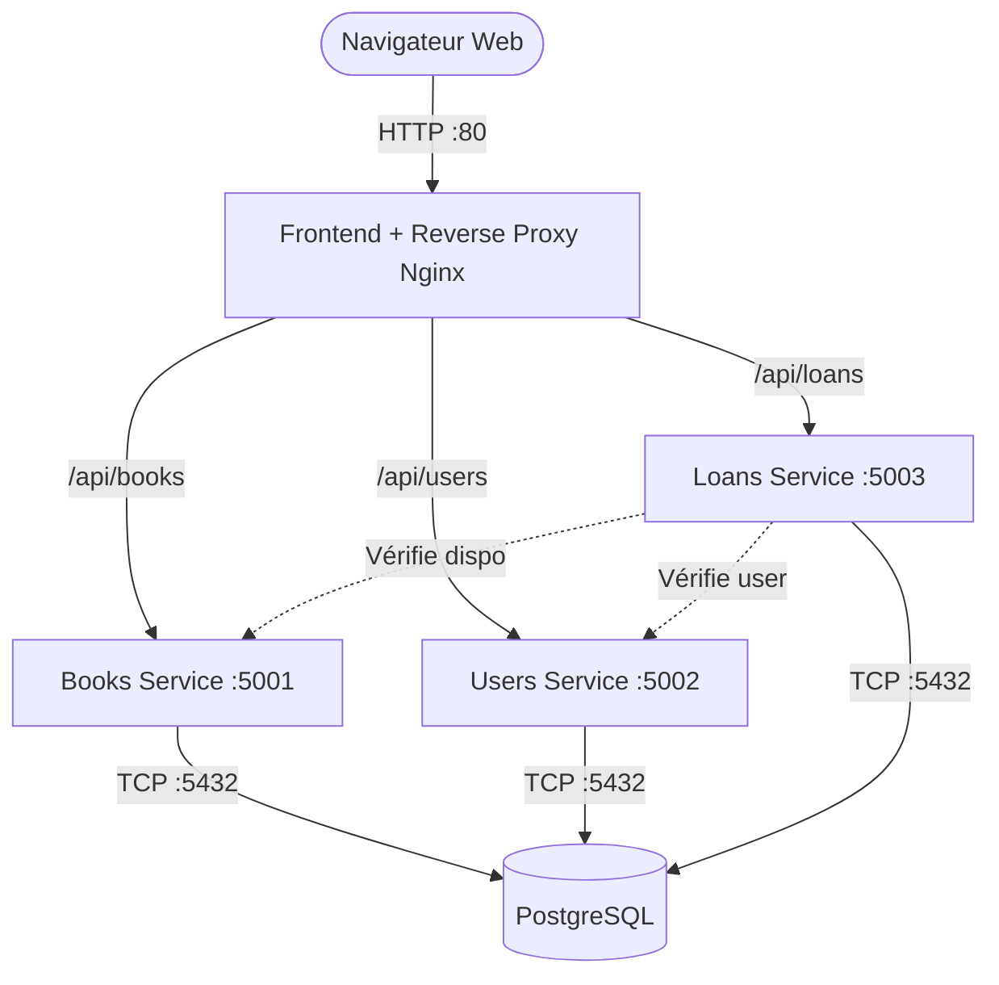

# 📚 DIT Bibliothèque Numérique — Architecture Microservices

**Projet DevOps — Master 1 Intelligence Artificielle — Dakar Institute of Technology (DIT)**  
**Période :** 09 Mars 2026 → 29 Mars 2026  
**Équipe du projet :** Babacar, Zakaia, Souleymane Diene, Fabrice Jordan Ramos  

---

Bienvenue dans le projet **DIT Bibliothèque Numérique**, une application complète de gestion de bibliothèque conçue avec une **architecture orientée microservices**. Ce projet met en œuvre les meilleures pratiques de développement, de conteneurisation et de déploiement.

## 🏗️ Architecture du Projet

L'application est découpée en plusieurs services indépendants qui communiquent entre eux via un réseau Docker interne, avec un point d'entrée unique (Reverse Proxy) géré par Nginx.



### 🛠️ Technologies Utilisées

*   **Frontend** : React.js (Vite), CSS natif (Dark mode UI type SaaS), Recharts (Graphiques), Lucide-React (Icônes vectorielles).
*   **Backend** : Python, Flask, Flask-SQLAlchemy, Flask-CORS.
*   **Base de données** : PostgreSQL 15.
*   **Documentation API** : Flasgger (Swagger UI).
*   **DevOps & Déploiement** : Docker, Docker Compose, Nginx (Serveur web & Reverse Proxy), Jenkins (CI/CD).

---

## 🚀 Installation et Démarrage

### Prérequis
*   [Docker](https://docs.docker.com/get-docker/) installé et en cours d'exécution.
*   [Docker Compose](https://docs.docker.com/compose/install/) (inclus dans Docker Desktop).
*   Git.

### Étapes d'installation

1. **Cloner le dépôt**
   ```bash
   git clone <url-du-repo>
   cd dit-bibliotheque-devops
   ```

2. **Lancer les conteneurs avec Docker Compose**
   À la racine du projet (où se trouve le fichier `docker-compose.yml`), exécutez :
   ```bash
   docker-compose up -d --build
   ```
   *L'option `-d` lance les conteneurs en arrière-plan.*

3. **Vérifier l'état des conteneurs**
   ```bash
   docker ps
   ```
   Vous devriez voir 5 conteneurs en cours d'exécution (`dit-frontend`, `dit-books`, `dit-users`, `dit-loans`, `dit-db`).

---

## 🌐 Points d'Accès et URLs (Swagger)

Une fois les conteneurs démarrés, voici comment accéder aux différentes parties de l'application :

| Composant | URL d'accès | Description |
| :--- | :--- | :--- |
| **Interface Web (UI)** | [http://localhost](http://localhost) | Le tableau de bord principal React |
| **Swagger Books** | [http://localhost:5001/apidocs](http://localhost:5001/apidocs) | Documentation interactive de l'API Livres |
| **Swagger Users** | [http://localhost:5002/apidocs](http://localhost:5002/apidocs) | Documentation interactive de l'API Utilisateurs |
| **Swagger Loans** | [http://localhost:5003/apidocs](http://localhost:5003/apidocs) | Documentation interactive de l'API Emprunts |

*Note : Le frontend interroge les APIs via Nginx (ex: `http://localhost/api/books`), ce qui évite les problèmes de CORS.*

---

## 🔌 Endpoints et Opérations Possibles

Chaque microservice expose des endpoints spécifiques pour gérer ses entités. Toutes ces opérations peuvent être testées directement via les interfaces Swagger mentionnées ci-dessus.

### 📖 Books Service (Port 5001)
*   `GET /api/books` : Récupère la liste de tous les livres (supporte la recherche par titre/auteur/ISBN).
*   `GET /api/books/<id>` : Récupère les détails d'un livre spécifique.
*   `POST /api/books` : Ajoute un nouveau livre au catalogue.
*   `PUT /api/books/<id>` : Modifie les informations d'un livre existant.
*   `DELETE /api/books/<id>` : Supprime un livre du catalogue.
*   `PUT /api/books/<id>/availability` : Met à jour la disponibilité d'un livre (utilisé lors d'un emprunt ou d'un retour).
*   `GET /api/books/stats` : Récupère les statistiques globales (total, disponibles, empruntés).

### 👥 Users Service (Port 5002)
*   `GET /api/users` : Récupère la liste des utilisateurs (supporte le filtrage par type : Étudiant, Professeur, etc.).
*   `GET /api/users/<id>` : Récupère les détails d'un utilisateur.
*   `POST /api/users` : Crée un nouvel utilisateur.
*   `PUT /api/users/<id>` : Modifie les informations d'un utilisateur.
*   `DELETE /api/users/<id>` : Supprime un utilisateur.
*   `POST /api/users/login` : Authentification d'un utilisateur.
*   `GET /api/users/stats` : Récupère la répartition des utilisateurs par type.

### 🔄 Loans Service (Port 5003)
*   `GET /api/loans` : Récupère l'historique des emprunts (filtrable par statut, utilisateur ou livre).
*   `GET /api/loans/<id>` : Récupère les détails d'un emprunt.
*   `POST /api/loans` : Enregistre un nouvel emprunt (vérifie la disponibilité et décrémente le stock via le service Books).
*   `PUT /api/loans/<id>/return` : Enregistre le retour d'un livre (incrémente le stock via le service Books).
*   `GET /api/loans/stats` : Récupère les statistiques des emprunts (actifs, en retard, retournés).

---

## ⚙️ Fonctionnement Détaillé

### 1. Base de données (PostgreSQL)
*   Un seul conteneur de base de données est utilisé pour simplifier la gestion des ressources, mais chaque service gère ses propres tables (`books`, `users`, `loans`).
*   **Persistance** : Les données sont sauvegardées dans un volume Docker nommé `dit-postgres-data`.
*   **Seed initial** : Au premier démarrage, si les tables sont vides, les services insèrent automatiquement des données de test.

### 2. Microservices Backend (Flask)
Chaque service est indépendant et tourne via le serveur WSGI **Gunicorn** (2 workers par service) pour des performances optimales en production.

### 3. Frontend (React + Nginx)
*   **Temps réel** : Le tableau de bord React récupère les données des 3 APIs simultanément. Chaque action (ajout, suppression, retour de livre) déclenche un rafraîchissement global de l'état, mettant à jour les graphiques et les compteurs instantanément.
*   **Nginx** : Le `Dockerfile` du frontend utilise un build multi-étapes. Il compile l'application Node.js, puis place les fichiers statiques dans un serveur Nginx léger (Alpine). Nginx est configuré pour servir l'UI **ET** agir comme Reverse Proxy pour rediriger les appels `/api/*` vers les bons conteneurs backend.

---

## 🧹 Commandes Utiles

**Arrêter l'application (en conservant les données) :**
```bash
docker-compose down
```

**Arrêter l'application ET supprimer la base de données (Reset complet) :**
```bash
docker-compose down -v
```

**Voir les logs d'un service spécifique :**
```bash
docker logs dit-frontend -f
docker logs dit-loans -f
```

**Reconstruire un seul service après une modification de code :**
```bash
docker-compose up -d --build frontend
```

---

## 📁 Structure du Projet

```text
dit-bibliotheque-devops/
├── docker-compose.yml       # Orchestration des 5 conteneurs
├── Jenkinsfile              # Pipeline CI/CD
├── frontend/                # Application React
│   ├── Dockerfile           # Build multi-étapes (Node -> Nginx)
│   ├── nginx.conf           # Configuration du Reverse Proxy
│   └── src/                 # Code source React (Composants, Pages, CSS)
└── services/                # Microservices Backend Python
    ├── books/               # Service Livres (Port 5001)
    │   ├── Dockerfile
    │   ├── app.py           # Logique API + Swagger + DB Model
    │   └── requirements.txt
    ├── users/               # Service Utilisateurs (Port 5002)
    │   ├── Dockerfile
    │   ├── app.py
    │   └── requirements.txt
    └── loans/               # Service Emprunts (Port 5003)
        ├── Dockerfile
        ├── app.py
        └── requirements.txt
```